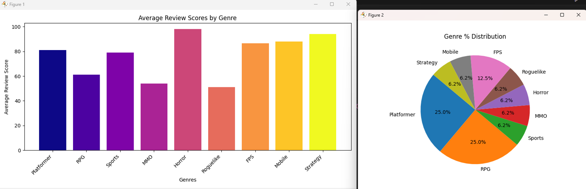

# buzzline-06-Sean
Project 6
Sean StClair

# Game Review Score Analysis Pipeline

## Overview
This project implements a **Kafka-based Producer-Consumer pipeline** to analyze **game review scores** categorized by genre. The consumer processes review scores and visualizes the data dynamically with **a two-part combined chart**:

- A **bar chart** displaying the **average review score** for each genre.
- A **pie chart** showing the **distribution of review messages** by genre.

## How It Works

1. The **Kafka Producer** generates game review messages containing:
   - The **game genre** (e.g., RPG, Shooter, Strategy, etc.)
   - A **review score** (integer value)
   
2. The **Kafka Consumer**:
   - **Extracts** the genre and review score from each message.
   - **Calculates** the running **average review score** for each genre.
   - **Tracks** the count of messages per genre.
   - **Updates a dynamic visualization** showing:
     - **A bar chart of average scores per genre**
     - **A pie chart of the proportion of messages per genre**

## Message Processing Details
Each message received follows this JSON structure:

```json
{
  "category": "RPG",
  "Review Score": 85
}
```

The consumer performs the following operations:

- Extracts `category` and `Review Score` fields.
- Updates a dictionary tracking the **total score** and **count** per genre.
- Computes the **average score** dynamically.
- Increments the **genre message count** to update the pie chart.
- Updates the visualization with **real-time data**.

This approach is interesting because it allows **live analysis of game reviews**, showing trends in genre review scores and message distribution as data flows in.

## Running the Pipeline

## Project Setup
### 1️. Create and Activate Virtual Environment
Before running the scripts, set up a virtual environment:
```powershell
# Create virtual environment
py -m venv .venv

# Activate virtual environment (Windows)
venv\Scripts\activate
```

### Install Required Dependencies
Ensure all necessary libraries are installed:
```powershell
pip install -r requirements.txt
```
### Start Zookeeper and Kafka (if not already running)
```sh
# Start Zookeeper
zookeeper-server-start.sh config/zookeeper.properties &

# Start Kafka Broker
kafka-server-start.sh config/server.properties &
```

## Running the Producer/Consumer
### Start the Producer
Run the producer to generate the hole-by-hole and total round scores.
```powershell
py -m producers.producer_Sean
```
This begins to generate game review score messages.

### Start the Consumer
Run the consumer to gather the hole/round/tournament scores and create the line chart.
```powershell
py -m consumers.consumer_Sean
```

## Visualization


## Dynamic Visualization
The consumer continuously updates the visualization with:

### 📊 **Bar Chart - Average Review Scores by Genre**
Shows the **average review scores** for each genre.

### 🥧 **Pie Chart - Review Message Distribution by Genre**
Displays the **proportion of messages received per genre**.



## Conclusion
This project showcases a **real-time data pipeline** for analyzing and visualizing game review scores using Kafka. It enables **continuous monitoring of review trends**, providing insights into how different genres are rated based on incoming messages.

